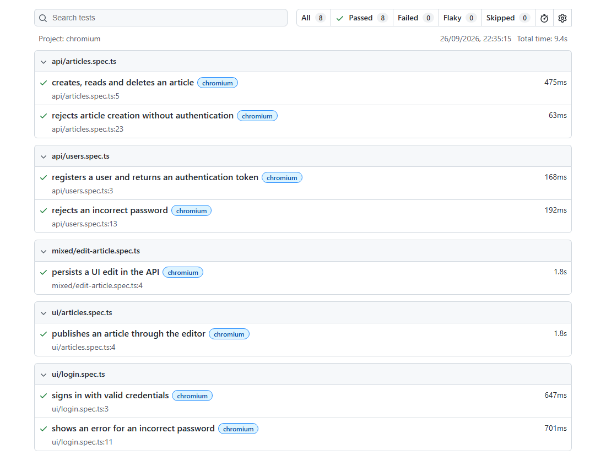

# RealWorld · Playwright

[](https://github.com/raphaelmanzolli/playwright-pipeline/actions/workflows/playwright.yml)

Test automation for an article publishing application using **Playwright, TypeScript, and Page Objects**. The main scenario follows **API → UI → API** to verify that an edit made in the browser is persisted by the backend.

<a href="docs/images/playwright-report.png"></a>

*RealWorld test report from a successful Chromium run. The same suite is validated by GitHub Actions.*

## Coverage and main flow

| Layer | Scenarios |
| --- | --- |
| API | Registration with a token; invalid password; article creation, retrieval, and deletion; unauthenticated creation |
| UI | Successful login; login error; article publishing |
| Mixed | API creation, UI editing, API verification and deletion |

The [main test](tests/mixed/edit-article.spec.ts) follows these steps:

1. Create a user and an article through the API.
2. Sign in through the UI and verify the article.
3. Edit and publish the article through the UI.
4. Query the API to verify the saved changes.
5. Delete the article and confirm it is no longer available.

Fixtures clean up test data after normal test execution, including failed assertions.

The suite currently has 8 tests with unique data per scenario. Comments, favorites, and profiles are not yet covered.

## Run locally

Prerequisites: **Git and Node.js 22.16.0**, the version used in the pipeline. No Docker, external service account, or separate database installation is required.

```bash
npm ci
npx playwright install chromium
npm run app:setup
npm test
```

On Linux, use `npx playwright install --with-deps chromium` to also install the browser's system dependencies.

The initial setup downloads and builds both applications. After that, `npm test` starts the API and UI, runs the tests, and shuts down the servers. Ports **3000** and **4173** must be available. Run only one suite at a time in the same directory.

| Command | Purpose |
| --- | --- |
| `npm test` | Run all tests |
| `npm run test:api` | Run API tests only |
| `npm run test:mixed` | Run the API → UI → API scenario |
| `npm run test:headed` | Run tests with a visible browser |
| `npm run test:ui` | Open Playwright's interactive UI mode |
| `npm run test:report` | Open the HTML report from the latest run |
| `npm run typecheck` | Check TypeScript types |

## Read the code

1. [Mixed test](tests/mixed/edit-article.spec.ts): the complete flow and its assertions.
2. [EditorPage](pages/EditorPage.ts): interactions with fields and buttons.
3. [ArticlesApi](api/ArticlesApi.ts): HTTP requests.
4. [Fixtures](fixtures/test.ts): resource setup and cleanup.

Tests contain behavior assertions. Page Objects handle interactions and expose locators, using accessible names and the application's test IDs. API clients return HTTP responses, while fixtures prepare resources and clean up after each test.

```text
api/              HTTP clients
pages/            Page Objects
fixtures/         Test setup and cleanup
test-data/        Unique users and articles
tests/
  api/            API scenarios
  ui/             Browser scenarios
  mixed/          API → UI → API scenario
app/              Local application setup
docs/             Environment details and report screenshot
```

## CI and test artifacts

The [GitHub Actions workflow](.github/workflows/playwright.yml) prepares the local application, checks types, and runs the suite in Chromium. It runs on pushes and pull requests targeting `main` or `master`, and can also be triggered manually.

On failure, Playwright retains a screenshot, video, and trace. The HTML report and test results are uploaded as artifacts for seven days. CI allows one retry per test; tests that pass on retry appear as *flaky* in the report.

[View workflow runs](https://github.com/raphaelmanzolli/playwright-pipeline/actions/workflows/playwright.yml). For local results, run `npm run test:report`.

## Local environment

The suite runs [RealWorld](https://github.com/realworld-apps/realworld) locally with a Vue 3 frontend and a Nitro + Prisma backend backed by SQLite.
Application commits and dependencies are pinned, and the UI calls the real local API.
This repository contributes the test automation and setup; the applications retain their authors' licenses.
See [environment details](docs/environment.md) for versions, setup adaptations, database cleanup, and interruption limits.
